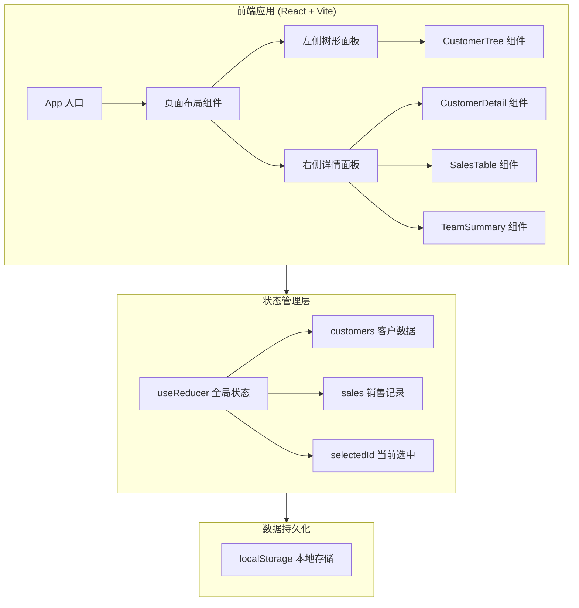
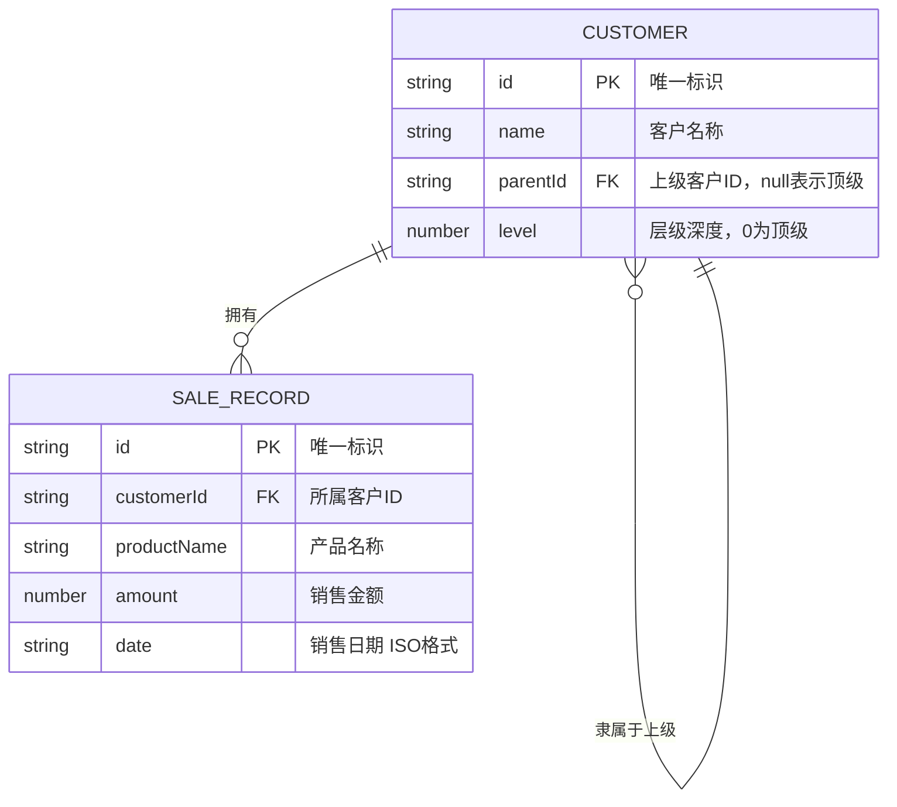

## 1. 架构设计



## 2. 技术选型

| 技术 | 版本 | 用途 |
|------|------|------|
| React | ^18.3 | 前端框架 |
| Vite | ^5.x | 构建工具 |
| Tailwind CSS | ^3.x | 原子化CSS框架 |
| Lucide React | ^latest | 图标库 |
| localStorage | Web API | 数据持久化（无需后端） |

- **初始化工具**：Vite + React 模板
- **后端**：无（纯前端应用，使用 localStorage 持久化）
- **数据库**：localStorage（JSON 格式存储）

## 3. 路由定义

本项目为单页应用，无需路由，采用状态驱动的视图切换：

| 视图状态 | 说明 |
|----------|------|
| 默认视图 | 左右分栏：客户树 + 详情面板 |
| 新增客户弹窗 | 模态框覆盖层 |
| 新增销售记录弹窗 | 模态框覆盖层 |
| 空状态视图 | 无数据时的引导提示 |

## 4. 数据模型

### 4.1 ER 关系图



### 4.2 TypeScript 类型定义

```typescript
interface Customer {
  id: string;
  name: string;
  parentId: string | null;
}

interface SaleRecord {
  id: string;
  customerId: string;
  productName: string;
  amount: number;
  date: string;
}

interface AppState {
  customers: Customer[];
  sales: SaleRecord[];
  selectedCustomerId: string | null;
}
```

### 4.3 数据定义说明

- **Customer**：客户实体，通过 `parentId` 形成树形结构，`parentId` 为 `null` 表示顶级节点
- **SaleRecord**：销售记录，通过 `customerId` 关联到具体客户
- **层级计算**：根据 `parentId` 链递归计算每个节点的 `level`（运行时动态计算）
- **汇总逻辑**：从选中节点出发，DFS/BFS 遍历所有子节点，累加所有匹配的 SaleRecord.amount

## 5. 核心算法

### 5.1 树构建算法

输入扁平化的 Customer 数组，输出树形结构：

```
buildTree(customers: Customer[]): TreeNode[]
1. 创建 id -> node 的 Map
2. 遍历 customers，每个 customer 转为 TreeNode
3. 若 parentId 为 null，加入根节点数组
4. 否则找到父节点，push 到 parent.children
5. 返回根节点数组
```

### 5.2 团队汇总算法

```
getTeamSales(customerId: string, customers, sales): TeamResult
1. 找到 customerId 对应节点
2. BFS/DFS 收集该节点及所有后代节点的 ID 集合
3. 过滤 sales 中 customerId 在集合内的记录
4. 按客户分组统计每人小计
5. 返回 { totalAmount, memberBreakdown[] }
```

## 6. 项目文件结构

```
src/
├── main.tsx                    # 应用入口
├── App.tsx                     # 根组件
├── index.css                   # 全局样式 + Tailwind
├── types/
│   └── index.ts                # 类型定义
├── data/
│   ├── store.ts                # useReducer 状态管理
│   ├── storage.ts              # localStorage 读写
│   └── utils.ts                # 树构建、汇总算法等工具函数
├── components/
│   ├── Layout.tsx              # 整体布局（顶栏 + 左右分栏）
│   ├── Header.tsx              # 顶部导航栏
│   ├── CustomerTree.tsx        # 左侧客户树形列表
│   ├── CustomerDetail.tsx      # 右侧客户详情面板
│   ├── SalesTable.tsx          # 销售记录表格
│   ├── TeamSummary.tsx         # 团队汇总卡片
│   ├── AddCustomerModal.tsx    # 新增客户弹窗
│   ├── AddSaleModal.tsx        # 新增销售记录弹窗
│   └── EmptyState.tsx          # 空状态提示
└── hooks/
    └── useAppState.ts          # 全局状态 Hook 封装
```
