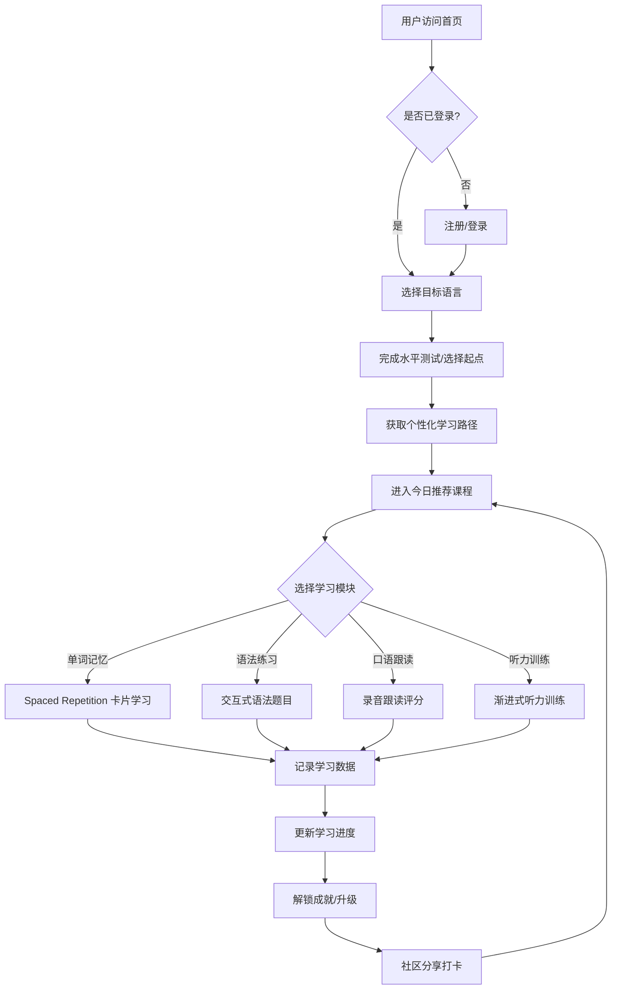
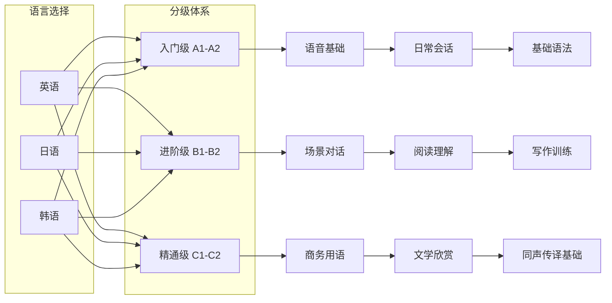

# 多语种在线教育平台 - 产品需求文档 (PRD)

## 1. 产品概述

**LinguaFlow** 是一款沉浸式多语种在线学习平台，支持英语、日语、韩语等主流语言学习。平台通过分级课程体系、互动式学习模块、智能学习路径推荐及社区激励系统，为语言学习者打造从零基础到精通的完整学习体验。

- **目标用户**：18-45岁语言学习爱好者、留学生预备人群、职场外语提升者
- **核心价值**：沉浸式互动学习 + 个性化路径 + 社区驱动成长

## 2. 核心功能

### 2.1 用户角色

| 角色 | 注册方式 | 核心权限 |
|------|----------|----------|
| 学习者 | 邮箱/手机注册 | 浏览课程、完成学习任务、参与社区、查看进度 |
| 访客 | 无需注册 | 浏览公开课程内容、体验部分免费功能 |

### 2.2 功能模块

1. **首页**：品牌展示、语言选择入口、课程推荐、学习数据概览
2. **课程中心**：分级课程体系浏览、课程详情、章节目录
3. **学习模块**：单词记忆（ spaced repetition）、语法练习（交互式）、口语跟读（录音对比）、听力训练（渐进式）
4. **个人中心**：学习进度仪表盘、成就徽章、学习统计、个人设置
5. **社区广场**：学习动态流、话题讨论、学习小组、经验分享
6. **登录注册**：用户认证、第三方登录、密码找回

### 2.3 页面详情

| 页面名称 | 模块名称 | 功能描述 |
|-----------|----------|----------|
| 首页 | Hero 区域 | 动态语言切换背景、品牌标语、CTA按钮、语言选择卡片 |
| 首页 | 推荐课程轮播 | 精选课程横向滚动卡片，含难度标签和进度预览 |
| 首页 | 学习数据速览 | 登录后显示今日学习时长、连续天数、单词掌握数 |
| 课程中心 | 语言筛选栏 | 英语/日语/韩语 Tab 切换，支持全部/初级/中级/高级筛选 |
| 课程中心 | 课程卡片网格 | 封面图、课程名、等级、课时数、学习人数、进度条 |
| 课程详情 | 课程信息区 | 课程介绍、教学目标、先修要求、讲师信息 |
| 课程详情 | 章节目录树 | 可展开的单元-课时树形结构，标记已完成状态 |
| 单词记忆 | 学习界面 | 卡片翻转动画（正面词义→反面例句）、发音播放、熟悉度滑块 |
| 单词记忆 | 复习模式 | 艾宾浩斯遗忘曲线驱动的复习队列 |
| 语法练习 | 交互式题目 | 填空题/选择题/排序题，即时反馈与解析 |
| 口语跟读 | 录音练习 | 原音播放→跟读录制→波形对比→AI评分反馈 |
| 听力训练 | 渐进式训练 | 音频播放+字幕可选→理解选择题→听写填空 |
| 个人中心 | 进度仪表盘 | 环形进度图、各语言能力雷达图、周/月学习热力图 |
| 个人中心 | 成就墙 | 徽章网格展示、解锁条件提示、稀有度标识 |
| 社区广场 | 动态信息流 | 用户学习打卡、心得分享、点赞评论 |
| 社区广场 | 话题板块 | 按语言/主题分类的讨论区 |
| 登录注册 | 表单区域 | 邮箱/密码输入、验证码、社交登录按钮 |

## 3. 核心流程

### 3.1 用户学习主流程

### 3.2 课程体系流程

## 4. 用户界面设计

### 4.1 设计风格

- **设计方向**：「知识花园」— 温暖有机的学习空间感，融合现代极简与自然质感
- **主色调**：
  - 英语主题：深海蓝 `#1a365d` + 琥珀金 `#d69e2e`
  - 日语主题：樱粉 `#e53e3e` + 山茶白 `#fff5f5`
  - 韩语主题：松绿 `#2f855a` + 月光银 `#e2e8f0`
- **中性色系**：暖灰 `#f7fafc` 背景、深炭 `#1a202c` 文字
- **按钮风格**：圆角胶囊状（border-radius: 24px），带微妙阴影和 hover 上浮效果
- **字体选择**：
  - 标题字体：`Outfit`（几何无衬线，现代感强）
  - 正文字体：`Noto Sans SC`（多语言支持优秀）
  - 强调字体：`Playfair Display`（用于标语和特殊标题）
- **布局风格**：卡片式布局 + 大量留白 + 不对称网格
- **图标风格**：线性图标（Lucide Icons）+ 自定义语言相关 SVG 图标
- **动画效果**：页面入场 staggered reveal、卡片 hover 微弹跳、进度条平滑填充、翻卡 3D 翻转

### 4.2 页面设计概述

| 页面名称 | 模块名称 | UI 元素 |
|-----------|----------|---------|
| 首页 | Hero 区域 | 全屏渐变背景 + 浮动语言气泡装饰、大标题渐变文字、双 CTA 按钮（开始学习/浏览课程）、毛玻璃导航栏 |
| 首页 | 推荐课程 | 横向滚动卡片容器、悬停时卡片上浮+阴影加深、封面图带语言标识角标 |
| 首页 | 数据面板 | 四宫格统计卡片、数字计数动画、环形进度 SVG |
| 课程中心 | 筛选栏 | 胶囊 Tab 切换器、下划线滑动指示器、搜索框带放大镜动效 |
| 课程中心 | 卡片网格 | Masonry 式瀑布流或等距网格、悬停显示课程简介浮层 |
| 单词学习 | 卡片区 | 居中大卡片、3D 翻转 CSS 动画、底部操作栏（认识/不认识/发音） |
| 语法练习 | 题目区 | 题目进度条顶部固定、选项卡片点击反馈、正确/错误动画提示 |
| 口语跟读 | 录音区 | 双波形对比视图（原音 vs 录音）、圆形录音按钮脉冲动画、评分仪表盘 |
| 听力训练 | 播放区 | 音频可视化波形、可调倍速控制、同步高亮歌词/字幕 |
| 个人中心 | 仪表盘 | 大型环形总进度、能力雷达图（Canvas/SVG）、日历热力图 |
| 社区 | 信息流 | 卡片式帖子流、头像+昵称+时间戳、图片/文字混排、互动按钮行 |

### 4.3 响应式策略

- **桌面优先**（≥1024px）：多列布局、侧边导航、丰富动效
- **平板适配**（768px-1023px）：双列布局、折叠菜单、保留核心动效
- **移动端优化**（<768px）：单列堆叠、底部 Tab 导航、触摸友好的大按钮（min 44px）

## 5. 数据需求

### 5.1 Mock 数据范围

- **课程数据**：每语言 3 个级别 × 3 门课程 = 9 门课/语言，共约 27 门课程
- **单词库**：每语言约 100 个示例单词（含音标、释义、例句）
- **语法点**：每语言约 20 个语法知识点及配套练习题
- **听力材料**：每语言 10 段示例音频（使用文本模拟）
- **用户数据**：模拟用户档案、学习记录、成就数据
- **社区内容**：模拟帖子 15-20 条、评论数据
