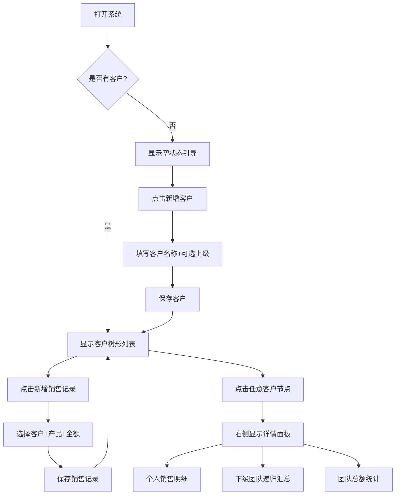

## 1. 产品概述

一款支持多级团队层级关系的客户销售管理系统，用于记录客户信息与日常销售数据。系统支持无限层级的上下级关联，销售数据自动向上汇总至所有上级节点，点击任意客户即可查看其个人及整个下级团队的销售明细与总额统计。

- **核心价值**：解决销售人员/团队管理者对客户关系管理与多级团队业绩汇总的需求
- **目标用户**：销售团队、代理商、分销商等具有层级组织结构的业务场景

## 2. 核心功能

### 2.1 功能模块

| 模块名称 | 功能描述 |
|----------|----------|
| 客户管理 | 新增/编辑客户信息、设置上级关联关系 |
| 销售记录 | 录入客户对应的销售产品与金额 |
| 团队树形视图 | 以树状结构展示所有客户的层级关系 |
| 数据汇总面板 | 点击客户查看个人明细 + 下级团队汇总 |

### 2.2 页面详情

| 页面/区域 | 模块名称 | 功能描述 |
|-----------|----------|----------|
| 主界面 | 左侧面板 - 客户树形列表 | 展示所有客户及其层级关系，支持展开/折叠，点击选中客户 |
| 主界面 | 右侧面板 - 客户详情区 | 显示选中客户的个人信息、销售记录列表、团队总销售额 |
| 主界面 | 顶部操作栏 | 新增客户按钮、新增销售记录按钮、搜索框 |
| 弹窗 | 新增/编辑客户弹窗 | 输入客户名称、选择上级客户（可选） |
| 弹窗 | 新增销售记录弹窗 | 选择客户、输入产品名称、输入销售金额 |

## 3. 核心流程

### 3.1 用户操作主流程

1. 用户打开系统 → 看到空状态或已有客户树
2. 点击「新增客户」→ 填写客户名称 → 可选填上级客户 → 保存
3. 点击「新增销售记录」→ 选择客户 → 填写产品名称和金额 → 保存
4. 在左侧树中点击任意客户 → 右侧显示该客户：
   - 个人基本信息（名称、上级）
   - 个人销售记录明细表
   - 下级团队成员列表（可递归展示）
   - 团队销售总额（含自身及所有下级）

### 3.2 数据汇总逻辑

```
客户A（顶级）
├── 客户B（A的下级）
│   ├── 客户C（B的下级）
│   │   └── 销售额: ¥5000
│   └── 销售额: ¥3000
└── 客户D（A的下级）
    └── 销售额: ¥2000

→ 点击A：总额 = A自身销售额 + B(3000) + C(5000) + D(2000)
→ 点击B：总额 = B自身销售额 + C(5000)
→ 点击C：总额 = C自身销售额(5000)
```



## 4. 界面设计

### 4.1 设计风格

- **风格定位**：专业商务风格，深色主题搭配明亮的数据高亮色
- **主色调**：深蓝灰底色 `#0f172a`，卡片背景 `#1e293b`，强调色 `#10b981`（翡翠绿，代表增长/收入）
- **辅助色**：警告色 `#f59e0b`（琥珀金），文字色 `#f1f5f9` / `#94a3b8`
- **按钮样式**：圆角胶囊按钮，hover 时发光效果，主操作用渐变绿
- **字体**：标题使用 `Outfit`（现代几何无衬线），正文使用 `DM Sans`
- **布局**：左右分栏布局，左侧固定宽度树形面板，右侧自适应详情区
- **图标**：线性图标风格，使用 Lucide 图标集

### 4.2 页面设计概览

| 区域 | UI元素 | 设计说明 |
|------|--------|----------|
| 顶部导航栏 | Logo + 标题 + 操作按钮组 | 深色背景，底部细线分隔，右侧放置新增按钮 |
| 左侧面板 | 树形客户列表 | 可滚动区域，缩进表示层级，连接线装饰，当前选中高亮 |
| 右侧详情面板 | 客户信息卡 | 大号客户名 + 徽章标签（层级深度），关键数据大字展示 |
| 右侧详情面板 | 销售记录表格 | 表格形式展示每条销售记录，含产品名、金额、时间 |
| 右侧详情面板 | 团队汇总卡片 | 递归展示下级成员及其各自销售额，底部显示团队总计 |
| 弹窗 | 表单弹窗 | 居中模态框，毛玻璃背景遮罩，输入框带浮动标签 |

### 4.3 响应式设计

- 桌面端优先（≥1024px）：左右双栏布局
- 平板端（768px-1023px）：可折叠侧边栏，详情区全宽
- 移动端（<768px）：单栏堆叠，树形列表可展开为全屏抽屉
