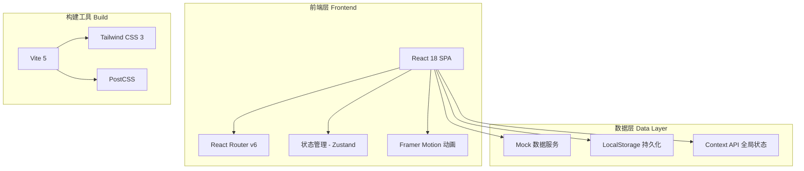
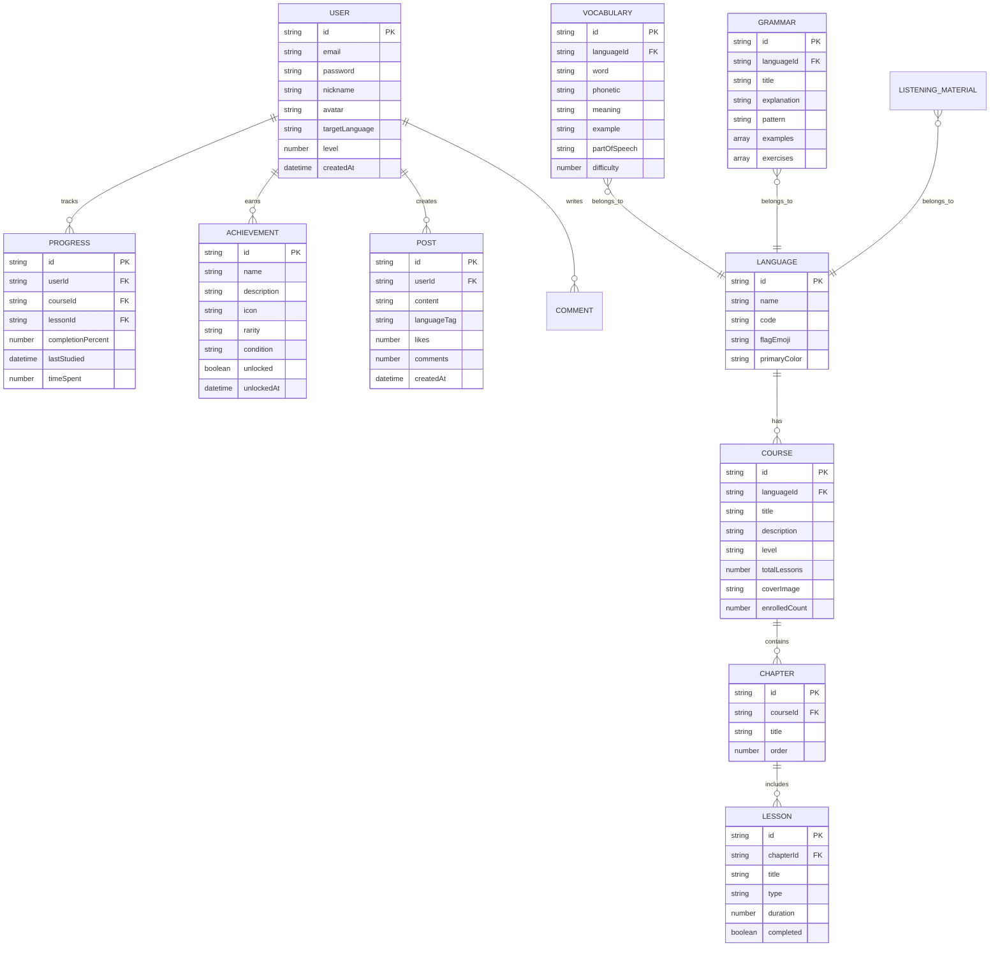

# 多语种在线教育平台 - 技术架构文档

## 1. 架构设计



## 2. 技术选型

| 技术领域 | 选型方案 | 版本 | 说明 |
|----------|----------|------|------|
| 前端框架 | React | 18.x | 组件化开发，生态成熟 |
| 构建工具 | Vite | 5.x | 快速冷启动、HMR |
| CSS 方案 | Tailwind CSS | 3.x | 原子化 CSS、快速原型开发 |
| 路由管理 | React Router DOM | 6.x | 声明式路由、嵌套路由 |
| 状态管理 | Zustand | 4.x | 轻量级、简洁 API |
| 动画库 | Framer Motion | 11.x | 声明式动画、手势支持 |
| 图标库 | Lucide React | 最新 | 一致性线性图标 |
| 图表库 | Recharts | 2.x | 进度图表、雷达图、热力图 |
| 字体 | Google Fonts | - | Outfit + Noto Sans SC + Playfair Display |
| 语音合成 | Web Speech API | - | 浏览器原生 TTS 用于发音 |

## 3. 项目结构

```
linguaflow/
├── public/
│   └── favicon.svg
├── src/
│   ├── assets/
│   │   ├── images/          # 静态图片资源
│   │   └── data/
│   │       ├── courses.ts   # 课程 Mock 数据
│   │       ├── vocabulary.ts# 单词库数据
│   │       ├── grammar.ts   # 语法练习数据
│   │       ├── listening.ts # 听力材料数据
│   │       ├── community.ts # 社区内容数据
│   │       └── achievements.ts # 成就定义数据
│   ├── components/
│   │   ├── common/          # 通用组件
│   │   │   ├── Button.tsx
│   │   │   ├── Card.tsx
│   │   │   ├── Modal.tsx
│   │   │   ├── ProgressBar.tsx
│   │   │   ├── Badge.tsx
│   │   │   └── Avatar.tsx
│   │   ├── layout/          # 布局组件
│   │   │   ├── Header.tsx
│   │   │   ├── Footer.tsx
│   │   │   ├── Sidebar.tsx
│   │   │   ├── MobileNav.tsx
│   │   │   └── MainLayout.tsx
│   │   ├── home/            # 首页组件
│   │   │   ├── HeroSection.tsx
│   │   │   ├── CourseCarousel.tsx
│   │   │   ├── StatsPanel.tsx
│   │   │   └── LanguageSelector.tsx
│   │   ├── course/          # 课程组件
│   │   │   ├── CourseGrid.tsx
│   │   │   ├── CourseCard.tsx
│   │   │   ├── CourseDetail.tsx
│   │   │   ├── ChapterTree.tsx
│   │   │   └── CourseFilter.tsx
│   │   ├── learn/           # 学习模块组件
│   │   │   ├── FlashCard.tsx
│   │   │   ├── VocabularyLesson.tsx
│   │   │   ├── GrammarQuiz.tsx
│   │   │   ├── SpeakingPractice.tsx
│   │   │   ├── ListeningTrainer.tsx
│   │   │   └── Waveform.tsx
│   │   ├── progress/        # 进度追踪组件
│   │   │   ├── ProgressRing.tsx
│   │   │   ├── RadarChart.tsx
│   │   │   ├── HeatmapCalendar.tsx
│   │   │   └── StatsCards.tsx
│   │   ├── community/       # 社区组件
│   │   │   ├── PostFeed.tsx
│   │   │   ├── PostCard.tsx
│   │   │   ├── CommentSection.tsx
│   │   │   └── TopicBoard.tsx
│   │   ├── achievement/     # 成就系统组件
│   │   │   ├── AchievementGrid.tsx
│   │   │   ├── AchievementCard.tsx
│   │   │   └── BadgeDisplay.tsx
│   │   └── auth/            # 认证组件
│   │       ├── LoginForm.tsx
│   │       ├── RegisterForm.tsx
│   │       └── AuthGuard.tsx
│   ├── pages/
│   │   ├── HomePage.tsx
│   │   ├── CourseListPage.tsx
│   │   ├── CourseDetailPage.tsx
│   │   ├── LearnPage.tsx
│   │   ├── VocabularyPage.tsx
│   │   ├── GrammarPage.tsx
│   │   ├── SpeakingPage.tsx
│   │   ├── ListeningPage.tsx
│   │   ├── ProgressPage.tsx
│   │   ├── CommunityPage.tsx
│   │   ├── ProfilePage.tsx
│   │   ├── LoginPage.tsx
│   │   └── RegisterPage.tsx
│   ├── stores/
│   │   ├── useAuthStore.ts      # 用户认证状态
│   │   ├── useCourseStore.ts    # 课程数据状态
│   │   ├── useLearnStore.ts     # 学习过程状态
│   │   ├── useProgressStore.ts  # 学习进度状态
│   │   └── useCommunityStore.ts # 社区状态
│   ├── hooks/
│   │   ├── useSpeechSynthesis.ts  # TTS 语音合成
│   │   ├── useLocalStorage.ts    # 本地存储
│   │   ├── useSpacedRepetition.ts# 间隔重复算法
│   │   └── useMediaRecorder.ts   # 录音功能
│   ├── utils/
│   │   ├── spacedRepetition.ts   # 艾宾浩斯算法实现
│   │   ├── pathRecommendation.ts # 学习路径推荐算法
│   │   ├── formatters.ts         # 数据格式化工具
│   │   └── constants.ts          # 全局常量定义
│   ├── types/
│   │   ├── index.ts              # 全局类型定义
│   │   ├── course.ts             # 课程相关类型
│   │   ├── user.ts               # 用户相关类型
│   │   └── learn.ts              # 学习相关类型
│   ├── styles/
│   │   └── globals.css           # 全局样式 + Tailwind 配置
│   ├── App.tsx
│   ├── main.tsx
│   └── vite-env.d.ts
├── index.html
├── tailwind.config.ts
├── postcss.config.js
├── tsconfig.json
├── vite.config.ts
├── package.json
└── tsconfig.app.json
```

## 4. 路由定义

| 路由路径 | 页面名称 | 说明 |
|----------|----------|------|
| `/` | 首页 | 平台主页，含 Hero、推荐课程、数据概览 |
| `/courses` | 课程中心 | 所有课程列表，支持语言和级别筛选 |
| `/courses/:id` | 课程详情 | 课程介绍、章节目录、学习入口 |
| `/learn/vocabulary/:lang` | 单词学习 | 闪卡式单词记忆模块 |
| `/learn/grammar/:lang` | 语法练习 | 交互式语法题目练习 |
| `/learn/speaking/:lang` | 口语跟读 | 录音跟读与评分模块 |
| `/learn/listening/:lang` | 听力训练 | 渐进式听力理解训练 |
| `/progress` | 学习进度 | 进度仪表盘、统计数据、能力分析 |
| `/community` | 社区广场 | 学习动态、话题讨论、经验分享 |
| `/profile` | 个人中心 | 用户设置、成就墙、个人信息 |
| `/login` | 登录 | 用户登录表单 |
| `/register` | 注册 | 用户注册表单 |

## 5. 数据模型

### 5.1 数据模型定义



### 5.2 核心类型定义 (TypeScript)

```typescript
// 语言类型
type LanguageCode = 'en' | 'ja' | 'ko';
type ProficiencyLevel = 'beginner' | 'intermediate' | 'advanced';

// 课程相关
interface Course {
  id: string;
  languageId: LanguageCode;
  title: string;
  description: string;
  level: ProficiencyLevel;
  totalLessons: number;
  coverImage: string;
  enrolledCount: number;
  chapters: Chapter[];
}

interface Chapter {
  id: string;
  courseId: string;
  title: string;
  order: number;
  lessons: Lesson[];
}

interface Lesson {
  id: string;
  chapterId: string;
  title: string;
  type: 'vocabulary' | 'grammar' | 'speaking' | 'listening';
  duration: number;
  completed: boolean;
}

// 单词相关
interface VocabularyItem {
  id: string;
  languageId: LanguageCode;
  word: string;
  phonetic: string;
  meaning: string;
  example: string;
  exampleTranslation: string;
  partOfSpeech: string;
  difficulty: 1 | 2 | 3 | 4 | 5;
  masteryLevel: number;
  nextReviewAt: number;
  reviewCount: number;
}

// 语法相关
interface GrammarPoint {
  id: string;
  languageId: LanguageCode;
  title: string;
  explanation: string;
  pattern: string;
  examples: GrammarExample[];
  exercises: GrammarExercise[];
}

interface GrammarExample {
  sentence: string;
  translation: string;
  highlight: string;
}

interface GrammarExercise {
  id: string;
  type: 'fill-blank' | 'multiple-choice' | 'ordering';
  question: string;
  options?: string[];
  answer: string;
  explanation: string;
}

// 用户相关
interface User {
  id: string;
  email: string;
  nickname: string;
  avatar: string;
  targetLanguage: LanguageCode;
  currentLevel: ProficiencyLevel;
  joinDate: string;
  studyStreak: number;
  totalStudyMinutes: number;
}

// 进度相关
interface UserProgress {
  userId: string;
  courseId: string;
  completedLessons: string[];
  totalTimeSpent: number;
  vocabularyMastered: number;
  lastStudyDate: string;
  weeklyGoal: number;
  weeklyProgress: number;
}

// 成就相关
interface Achievement {
  id: string;
  name: string;
  description: string;
  icon: string;
  rarity: 'common' | 'rare' | 'epic' | 'legendary';
  category: string;
  condition: string;
  progress: number;
  maxProgress: number;
  unlockedAt: string | null;
}

// 社区相关
interface Post {
  id: string;
  author: User;
  content: string;
  images?: string[];
  languageTag: LanguageCode;
  likes: number;
  comments: Comment[];
  createdAt: string;
  isLiked: boolean;
}

interface Comment {
  id: string;
  author: User;
  content: string;
  createdAt: string;
  likes: number;
}
```

## 6. 核心算法说明

### 6.1 间隔重复算法 (Spaced Repetition - SM-2 变体)

基于艾宾浩斯遗忘曲线的单词复习调度：
- 正确回答 → 间隔指数增加，下次复习时间延后
- 错误回答 → 间隔重置为 1 天，重新进入学习循环
- 优先级 = `当前时间 - 应复习时间` 的值越大越优先

### 6.2 学习路径推荐算法

基于以下维度计算推荐权重：
- 当前级别匹配度 (40%)
- 弱项补强优先 (30%)
- 学习连续性 (20%)
- 兴趣偏好 (10%)

## 7. 性能与兼容性

- 目标浏览器：Chrome 90+、Firefox 88+、Safari 14+、Edge 90+
- 首屏加载目标：< 2s (LCP)
- 代码分割：路由级懒加载 + 组件级按需加载
- Web Speech API 降级方案：提供静音模式开关
